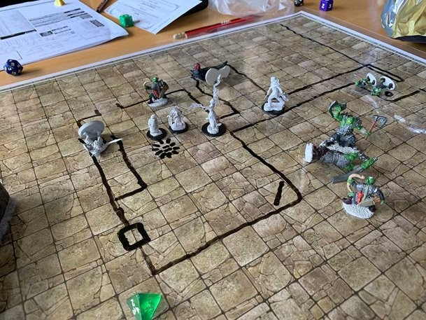
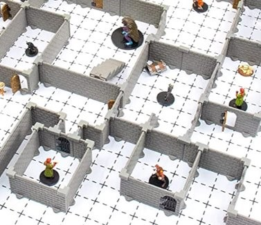
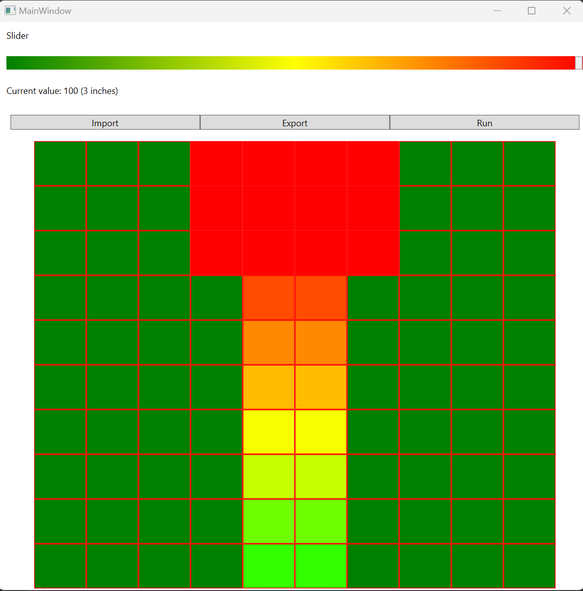
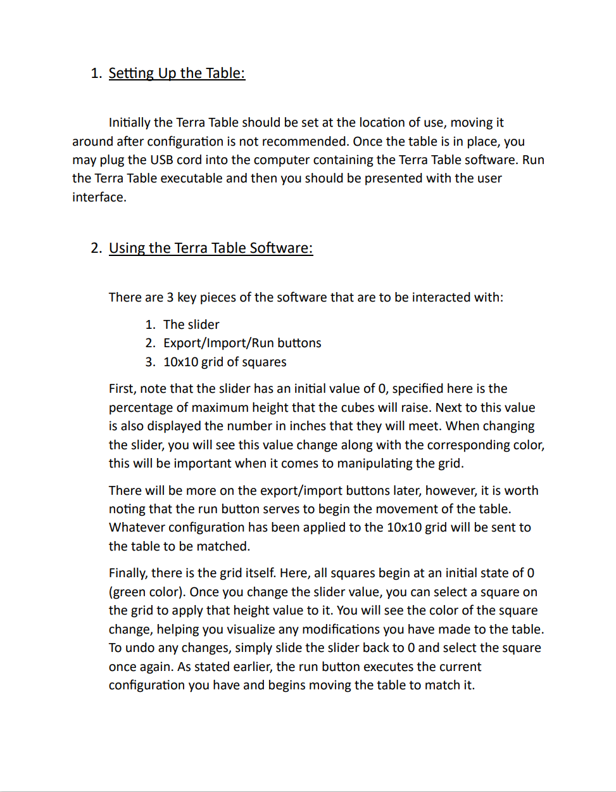
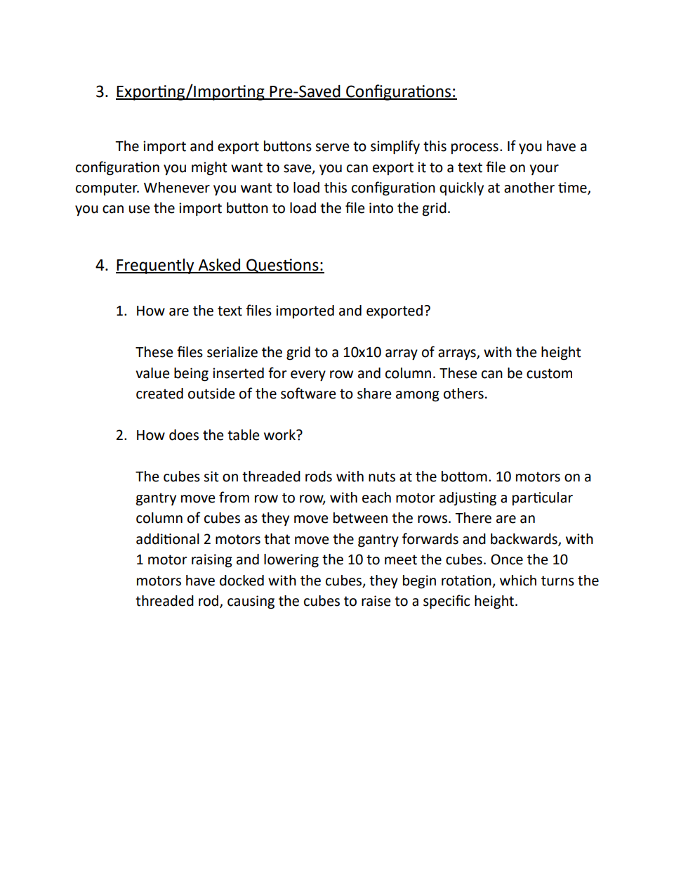
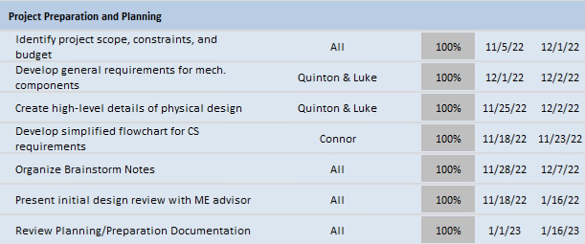
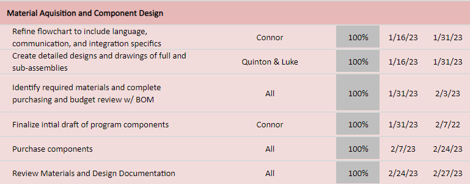
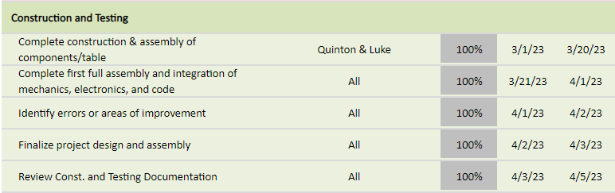
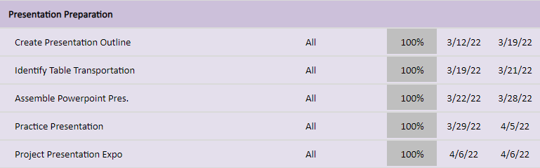
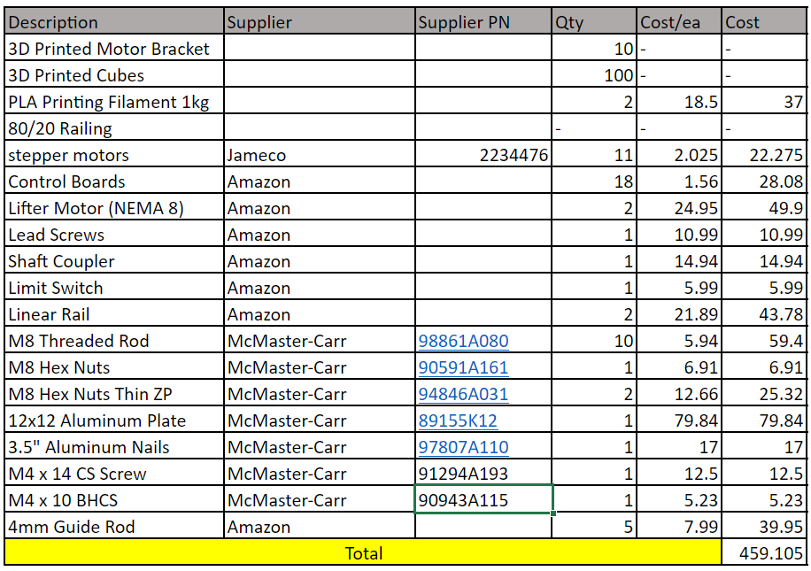

# Terra Table
# Table of Contents

1. [Project Description](#project-description)
2. [User Interface Specification](#user-interface-specification)
3. [Test Plan and Results](#test-plan-and-results)
4. [User Manual](#user-manual)
5. [Spring Final PPT Presentation](#spring-final-ppt-presentation)
6. [Final Expo Poster](#final-expo-poster)
7. [Assessments](#assessments)
    1. [Initial Self-Assessments](#initial-self-assessments)
    2. [Final Self-Assessments](#final-self-assessments)
8. [Summary of Hours and Justification](#summary-of-hours-and-justification)
9. [Summary of Expenses](#summary-of-expenses)
10. [Appendix](#appendix)

## Project Description

### Background
The purpose of this project is to elevate the gameplay experience of table-top role-playing games such as “Dungeons and Dragons”. These games are often played in the ‘theater of the mind’ using minimal props for visualizing the world in which the players are role-playing. However, many players do like to use a ‘battle mat’ to help visualize the specific locations and layouts of a certain area in the game.

These mats consist of a large grid of squares. Each square represents a scaled down distance in game; players can use miniature figures of their characters to represent where they are in the world. The downside to these mats is that they are low tech and only two dimensional. Some players turn to using small blocks or walls to create a more 3D feeling to their environments, while others invest time and money into creating elaborate dioramas for their games.

This project aims to bridge the gap between low tech battle mats and high detail dioramas with programable, 3D topography, built into the game table.

### Objectives
This project aims to create a device that can be inserted into any table and convert it into a 3D topographical map that is fully programable to create scenes and landscapes for their gameplay. The final product will consist of a grid of cubes, each capable of being raised and lowered to create a 3D landscape. The shape of the scene will be determined by a graphical user interface where the players can create their map in 2D in the program and then watch as their creation comes to life in the table.

## User Interface Specification

The user interface was designed using Windows Presentation Foundation (WPF), and consists of 3 key features:

1. A slider for specifying height
2. 3 buttons, for executing actions
3. A 10x10 grid of squares, visually representing what the physical table will look like

### Slider
The slider uses a gradient of colors from green to yellow to red, with a text box displaying the percentage of max height, and the corresponding height in inches. Whatever value is chosen on the slider will be applied to a grid square on click.

### Buttons
There are presently 3 buttons that allow the user to execute their respective actions:

1. Import: A text file can be imported, which will instantly apply a pre-recorded configuration to the grid.
2. Export: This exports the current configuration, so that at a later time it can be re-applied if desired.
3. Run: This executes the main functions of the table, sending the current configuration to the Arduino sketch. This is done by serialized communication with the board, and upon selecting this command the user will begin to see movements in the table until all cubes have been raised to desired height.

### Grid
The grid uses a gradient color scale to help the user visualize what they are creating on the table in 3 dimensions. From the image above, this would create something similar to a staircase, with a platform at the top. The idea was derived from topographical terrain maps that use gradients to visualize elevation on a 2 dimensional plane.

## Test Plan and Results

### Test Plan

For this project, the primary testing approach will be unit testing, supplemented by integration testing for more complex components. The goal is to adhere to Test-Driven Development (TDD) practices as closely as possible, as this has become a habit in professional work environments. Although TDD can sometimes be tedious, it is crucial to ensure that methods and classes are thoroughly tested.

Regardless of the specific approach, the project will have as many components (methods and classes) tested as feasible. Integration tests may be required when developing the Arduino aspect of the project, which might necessitate exploring various test suites capable of running both code segments concurrently in a single test.

For unit testing, NCrunch, a valuable tool for debugging and viewing all tests within a given solution simultaneously, will be utilized. Mocking frameworks and NUnit will be employed to construct the tests.

### Test Results

All tests can be found in the /Code/TerrainTableWpf/Tests subdirectory. There were 10 tests in total to ensure that all logic is set up properly, the testing matrix summarizing all aspects of the testing can be found below:

| Test Identifier | Purpose of Test | Inputs for Test | Expected Outputs/Results | Unit Test Indication |
| --------------- | ------------------------------------ | --------------- | ------------------------ | --------------- |
| MainWindowConstructor_CreatesExpectedTerrainGrid | Tests that the construction of the UI grid sets the initial state properly | None | Expected that all squares have an initial 'Green' state | Pass |
| ReadFileContent_ReturnsCorrectFileContent | Ensures the file reader returns exactly what is in the text files for importing | Encoded string of file content | Should return string decoded | Pass |
| DeserializeAndSetTerrainGrid_SetsTerrainGridHeightsCorrectly | Verifies that an array passed in sets the UI grid heights properly | String array representing square heights | Should set height of each terrain square | Pass
| SendSerializedGridToSerialPort_WritesSerializedGridToSerialPort | Verifies that the grid is sent to serial port of Arduino board | Serialized grid and port wrapper object | Should call port.write() with serialized grid as parameter | Pass
| SerializeGrid_SameHeightValues_ReturnsSerializedGrid | Sets the grid heights and checks that serialize grid returns the proper string | None | Should set serialized grid to same value as expected | Pass
| SerializeGrid_DifferentHeightValues_ReturnsSerializedGrid | Same test as previous, this time giving each square different heights | None | Should set serialized grid to same value as expected | Pass
| IntToColor_ValueZero_SetsGreenColor | Verifies that when 0 is passed in the color green is set | Integer height | Specified color set on main window green | Pass
| IntToColor_ValueOneHundred_SetsRedColor | Verifies that when 100 is passed in the color red is set | Integer height | Specified color set on main window red | Pass
| IntToColor_ValueFifty_SetsYellowColor | Verifies that when 50 is passed in the color yellow is set | Integer height | Specified color set on main window yellow | Pass
| Slider2_ValueChanged_ValueChanged_SetsSliderValueAndTextBlock1Text | Asserts that changing the slider position updates both the value and inches field | Property changed arguments | Percentage height and inches | Pass

## User Manual

[View the user manual directly here.](Assignments/TerraTableUserManual.pdf)
The user manual for this project was created to be printable, so was put in PDF form. Ideally, it would be shipped with the table all in one package.

## Spring Final PPT Presentation

[View the final presentation here.](Assignments/FinalPresentation.pptx)

## Final Expo Poster

[View the expo presentation here.](Assignments/ExpoPresentation.pptx)

## Assessments

### Initial Self-Assessments

Having developed a preliminary outline of the table's functionality and codebase, I have identified potential challenges and viable solutions. The most significant challenge involves writing the Arduino code, as this will be my first foray into programming a physical device, a departure from my prior experience in digital programming. Additionally, our team lacks electrical or computer engineering expertise, which may complicate the wiring and circuitry aspects of the project.

Regarding the user interface, I possess prior experience with Windows Presentation Foundation (WPF), which should facilitate a relatively seamless execution of this project component. Although my expertise in XAML is limited, my understanding of the fundamentals should be sufficient to prevent major obstacles during the project. I anticipate that designing and testing the user interface will consume less time than integrating the various components.

The primary focus of our efforts will likely be perfecting the motor movements and establishing the table's circuitry, which will prove essential to the successful completion of the project.

### Final Self-Assessments

My most significant contribution to the project was undoubtedly the codebase, encompassing both the Arduino and User Interface (UI) elements. Collaborating with two Mechanical Engineers, I was aware from the outset that the responsibility for all coding tasks would fall to me. During the planning phase, I identified challenges and knowledge gaps that could hinder progress. However, I am pleased to report that these obstacles were successfully overcome.

Developing the codebase entailed two primary components: the UI and the Arduino code. The UI was designed using Windows Presentation Foundation (WPF) and involved creating an MVVM (Model-View-ViewModel) application to enable user interaction. Although the program operates as intended, I encountered difficulties in adhering to the MVVM principles. The majority of my logic is housed in the MainWindow file, which is less than ideal within this architectural framework.

Despite these challenges, I gained valuable experience working with XAML and Arduino, and I now feel more confident in writing code using these languages. My personal greatest obstacle was serializing data from the UI to the Arduino board. Given my limited knowledge of circuitry, even seemingly minor tasks involving physical interaction with the code proved difficult to overcome.

## Summary of Hours and Justification

| Name    | Semester 1 Hours | Semester 2 Hours | Year Hours |
|---------|------------------|------------------|------------|
| Luke    | 24               | 48               | 72         |
| Quinton | 24               | 48               | 72         |
| Connor  | 24               | 48               | 72         |

Total hours: 216

We each only met when all were available, with the first semester consisting of 6 meetings regarding planning. In these meetings, Connor drafted flowcharts and researched architectures for the codebase, while Quinton and Luke create CAD drawings and modeled the product.

Semester 2 had 6 meetings in which we coded/assembled the table, which were each 4 hours each. As the expo approached, we had 3 8 hour days devoted to finishing up the table. This was almost all devoted to soldering capacitors, setting up the circuits, debugging the motors, and finishing assembly. In the appendix below you will find links to CAD drawings, diagrams, and pictures of the product that we took along the way.

Additionally, there were four phases compiled and formatted into a Gantt chart to keep track of tasks.

### Phase 1

### Phase 2

### Phase 3

### Phase 4

## Summary of Expenses

We were able to organize our entire bill of materials into a concise table:

## Appendix

### Drawings and Diagrams

[Motor calculations and rough drawings of design.](Notes/MotorsRoughDraft.pdf)

[Fully rendered model of the full assy.](Images/TableModelRendered.jpg)

[Detailed model of motor/cube relationship and setup.](Images/MotorsAndCubes.jpg)

[Cross section of the cubes visualizing the inserted threaded rod.](Images/CubeCrossSection.jpg)

### References

US bolts - tightening torques. Engineering ToolBox. (n.d.). Retrieved February 24, 2023, from https://www.engineeringtoolbox.com/us-bolts-torques-d_2055.html 

Beams - supported at both ends - continuous and point loads. Engineering ToolBox. (n.d.). Retrieved February 24, 2023, from https://www.engineeringtoolbox.com/beam-stress-deflection-d_1312.html 

Electric Motor Calculator. Engineering ToolBox. (n.d.). Retrieved February 24, 2023, from https://www.engineeringtoolbox.com/electrical-motor-calculator-d_832.html 

ASTM F963-17: Standard Consumer Safety Specification for Toy Safety, ASTM International Retrieved February 24, 2023,  
The Federal Register. Federal Register :: Request Access. (n.d.). Retrieved February 24, 2023, from https://www.ecfr.gov/current/title-16 

ULN2003 stepper motor drivers - electronicos caldas. (n.d.). Retrieved February 25, 2023, from https://www.electronicoscaldas.com/datasheet/ULN2003A-PCB.pdf 

Wilson, A. (2009, June 4). WPF colour slider. CodeProject. Retrieved February 24, 2023, from https://www.codeproject.com/Articles/36802/WPF-Colour-Slider 
